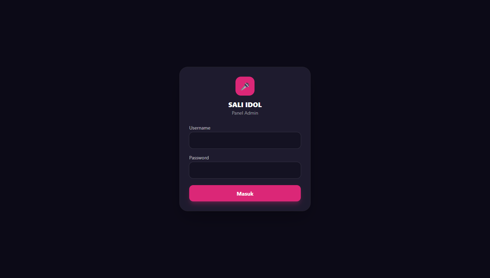
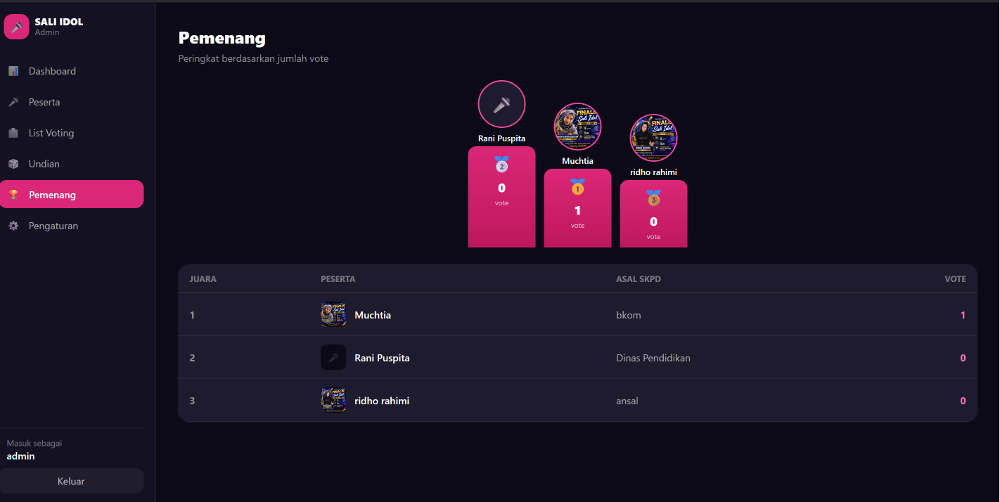
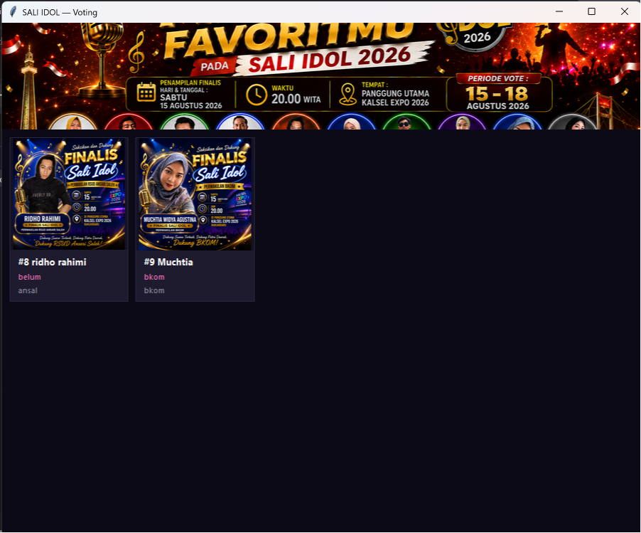

# 🎤 SALI IDOL — Platform Voting

Platform voting untuk kontes menyanyi **SALI IDOL**. Terdiri dari **dashboard admin
berbasis Cloudflare** dan **aplikasi voting desktop (.exe)**.

- **Admin:** Cloudflare Pages (React SPA) + Pages Functions (Hono) + **D1** + **R2**
- **Voting:** aplikasi desktop Python + tkinter (kiosk)
- **Aturan:** **1 nomor WhatsApp = 1 vote**. Tiap vote menghasilkan **kode undian**
  alfanumerik (mis. `1WCX-JWS3`) untuk doorprize.

> Live admin: **https://saliidol.pages.dev**

---

## 🏗️ Arsitektur

```
┌─────────────────────┐        ┌──────────────────────────────┐
│  Aplikasi Desktop   │  HTTPS │   Cloudflare Pages            │
│  (Python + tkinter) │ ─────► │   ├── SPA Admin (React)       │
│  Voting kiosk .exe  │        │   └── Functions (Hono API)    │
└─────────────────────┘        │         │            │        │
                               │      ┌──▼──┐      ┌──▼──┐     │
                               │      │ D1  │      │ R2  │     │
                               │      │ SQL │      │foto │     │
                               │      └─────┘      └─────┘     │
                               └──────────────────────────────┘
```

### Struktur repo
```
.
├── cf-admin/     # Dashboard admin — Cloudflare Pages (SPA + Functions + D1 + R2)
├── desktop/      # Aplikasi voting desktop (Python tkinter → .exe)
├── aturan_platform_voting.md   # Dokumen aturan anti voting-ganda
└── (root Next.js)              # Versi lama (deploy VPS) — legacy, referensi
```

---

## 📸 Screenshot

### Login Admin


### Pemenang (peringkat by vote)


### Aplikasi Voting Desktop


---

## ✨ Fitur

### Dashboard Admin
- **Dashboard** — statistik: jumlah peserta, total vote, undian ditarik, peserta terpopuler
- **Peserta** — CRUD peserta + upload foto (ke R2): no urut, nama, lagu wajib, lagu bebas, asal SKPD
- **List Voting** — tabel voter (nama, WhatsApp `wa.me`, peserta, kode undian)
- **Undian** — tarik pemenang doorprize acak (live shuffle), riwayat
- **Pemenang** — peringkat peserta by jumlah vote (podium 1/2/3)
- **Pengaturan** — judul acara, gambar header, favicon, batas vote (WITA), ganti password

### Aplikasi Voting (Desktop)
- Grid peserta (foto + `#no urut nama` + `lagu wajib - lagu bebas`)
- Klik peserta → input **Nama + Nomor WhatsApp** → konfirmasi → **popup kode undian**
- Mode **kiosk**: 1 perangkat dipakai banyak orang, batas 1 vote per **nomor WhatsApp**
- Layout responsif (mengikuti ukuran window)

---

## 🚀 Setup Admin (`cf-admin/`)

Prasyarat: Node.js 20+, akun Cloudflare, `wrangler` login.

```bash
cd cf-admin
npm install

# 1. Buat D1 + R2
npx wrangler d1 create saliidol           # salin database_id → wrangler.toml
npx wrangler r2 bucket create saliidol-media

# 2. Skema + seed admin
npx wrangler d1 execute saliidol --remote --file schema.sql
node seed-admin.mjs admin <password> > seed-admin.sql
npx wrangler d1 execute saliidol --remote --file seed-admin.sql

# 3. Secret sesi
npx wrangler pages secret put SESSION_SECRET   # isi string acak

# 4. Build + deploy
npm run build
npx wrangler pages deploy                       # → https://<project>.pages.dev
```

**Stack:** Vite · React · React Router · Tailwind · Hono · D1 (SQLite) · R2 ·
jose (JWT) · PBKDF2 (Web Crypto).

Dev lokal: `npx wrangler pages dev` (Functions) + `npm run dev` (SPA, proxy `/api`).

---

## 🖥️ Setup Aplikasi Voting (`desktop/`)

Prasyarat: Python 3.10+.

```bash
cd desktop
python -m pip install -r requirements.txt

# Set URL API (di config.ini, sebelah exe / main.py)
#   [app]
#   api_base = https://saliidol.pages.dev

python main.py            # jalankan (dev)
build.bat                 # build → dist/SALI-IDOL-Vote.exe (PyInstaller)
```

`config.ini` di samping `.exe` bisa diubah untuk ganti `api_base` **tanpa rebuild**.

**Stack:** Python · tkinter · Pillow · requests · PyInstaller.

---

## 🔐 Aturan anti voting-ganda

Lihat [`aturan_platform_voting.md`](aturan_platform_voting.md). Implementasi saat ini:
**1 nomor WhatsApp = 1 vote** (DB `UNIQUE(voter_whatsapp)`) + validasi server-side
(periode voting WITA, kandidat aktif, generate kode undian unik).

---

## 📝 Lisensi

Internal — kontes SALI IDOL.
